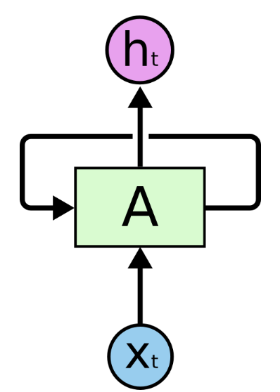

# RNN

순환 신경망 (Recurrent neural network) / 재귀 신경망 (Recursive neural network)

* 반복적인, 순차적인 데이터를 학습하는데 특화되어 발전한 인공신경망의 한 방식
  * 대표적으로 언어(Language)에 사용 (**단어** 다음에 **단어**가 올 것임이 확실한 데이터)
    * 음성인식, 단어의 의미 판단, 대화 등등이 가능 (자연어 처리 Natural Language Processing)
  * 영상, 소리 또한 순차적인 데이터 --> 동영상 분류, 음악 장르 분류 등이 가능
* 사람의 기억력을 구현하기 힘든 전통적인 뉴럴네트워크 알고리즘을 지적함
  * RNN은 루프가 들어있고, 과거의 데이터가 미래에 영향을 줄 수 있는 구조를 가지고 있음

## RNN의 기본구조

* 하나의 뉴럴 네트워크 덩어리 A는 Xt를 입력값으로 가지고 ht 를 결과값으로 내놓음.
* 루프는 정보가 다음 단계의 뉴럴 네트워크로 이동하게 만들어 줌
* RNN은 하나의 네트워크가 여러 개 복사된 형태
  * 각각의 네트워크는 다음 단계로 정보를 넘겨줌
  * 위 그림을 풀어서 보면 아래 그림과 같은 형태
  * 

## RNN 응용모델

* Vanilla RNN
  * 바닐라 --> 아무것도 첨가하지 않은 처음 상태의 아이스크림을 의미
  * 아무것도 가공하지 않은 처음 형태
  * 가장 단순한 형태의 RNN 모델을 뜻함

* LSTM
  * 가장 탁월
  * 장기 의존성 문제와 역전파시 일어나는 Gradient vanishing 문제 해결
  * RNN 기본 모델에서 일어나는 문제점들을 보완한 모델
  * 현재는 RNN이라고 하면 많은 경우 LSTM을 의미함
* GRU
  * LSTM의 간략화된 버전
    * LSTM의 게이트 3개를 2개로 축소
  * 대한민국의 조교수님이 만듦,,
* Bidirectional RNN
  * 양방향 RNN
  * 이전 정보 뿐만 아니라 이후 정보까지 고려하는 것이 특징
  * 두 방향의 은닉층에 모든 input값이 계산된 후에 적용시키는 방식으로 학습
* Deep (Bidirectional) RNN
  * 위의 Bidirectional 학습을 더 깊게 한 모델
  * 시간 스텝마다 여러 Layer가 있음
  * 학습데이터가 더 많이 필요함

## 기법, 문제들

* 임베딩 기법(Embedding)
  * 자연어 처리 문제를 다룰 때 널리 사용되는 기법
  * One-hot Encoding의 sparse한 데이터 표현 형태 문제를 해결
  * tf.nn.embedding_lookup API 사용해서 구현
* 장기 의존성 문제
  * LSTM이 해결

* 경사도 증가 문제와 경사도 자르기
* Char-RNN
  * RNN을 처음 배울 때 가장 많이 사용되는 예제 중 하나

## 활용분야

* **자연어처리 NLP**
  * 챗봇
    * google, ai 플랫폼 **Dialogflow**
* 음성 인식
* 음악 작곡
  * [영상](https://www.youtube.com/watch?v=j60J1cGINX4&feature=youtu.be)
* 주가 예측
* **이미지 캡션 생성**
* 문장 감성 분석기
* 언어 번역기
* 문장에서 다음에 나올 단어 예측하기
* ...

## 모델의 발전

보통 LSTM 모델에서 발전하거나, 장기 의존성 문제를 다른 방식으로 해결하며 여러가지 방법이 나오는 중

### LSTM 변칙패턴들

* [GRU](https://arxiv.org/pdf/1406.1078v3.pdf) - Cho, et al. (2014)
* [Depth Gated RNNs](https://arxiv.org/pdf/1508.03790v2.pdf) - Yao, et al. (2015)
* [Grid LSTMs](http://arxiv.org/pdf/1507.01526v1.pdf) - Kalchbrenner, et al. (2015)
* [Sliced RNN](https://arxiv.org/pdf/1807.02291.pdf) - Yu, et al. (2018)
  * GRU와 성능은 비슷하지만 100배 빠름 

### 새로운 방식으로 장기 의존성 문제 해결

* [Clockwork RNNs](https://arxiv.org/pdf/1402.3511v1.pdf) - Koutnik, et al. (2014)

### 변칙패턴들 비교분석

* [Greff, et al.](https://arxiv.org/pdf/1503.04069.pdf) (2015)
  * 변칙패턴들 각각이 거의 비슷함을 발견
* [Jozefowics, et al.](http://proceedings.mlr.press/v37/jozefowicz15.pdf) (2015)
  * 약 만 가지 이상의 RNN 아키텍쳐를 실험
  * 몇몇 RNN 변칙패턴들은 LSTM 보다 성능이 좋은 경우가 있음을 발견

## Attention

* LSTM 외에 RNN으로 성취할 또 하나의 빅 스텝으로 주목받는 중
* 모든 스텝의 RNN이 거대한 정보로부터 입력값을 받는 방식

## 다음에 공부할 내용

바닐라 RNN ~ LSTM 개념

