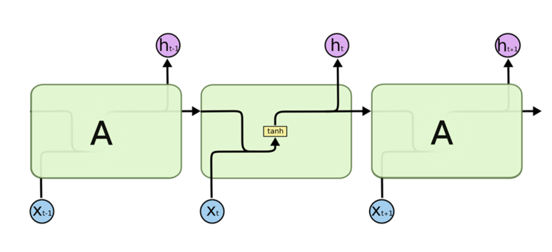
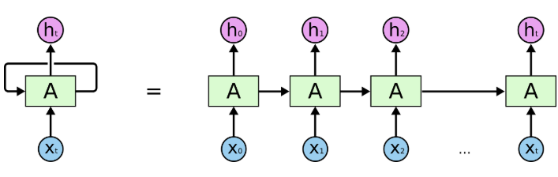
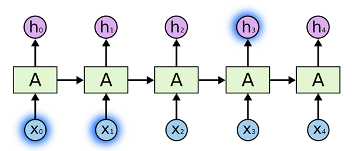
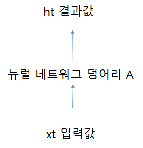
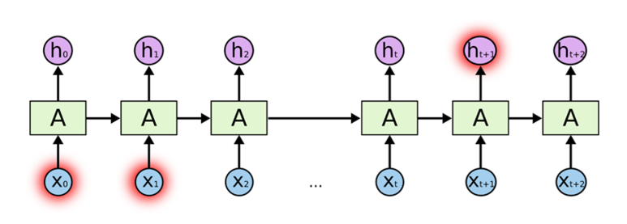
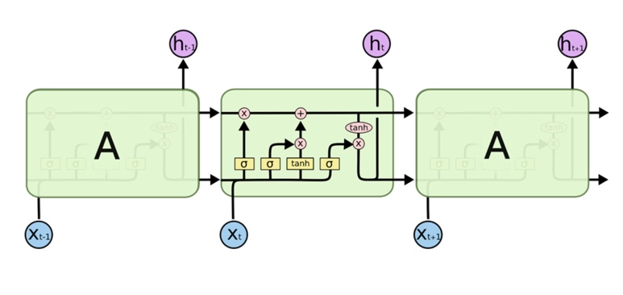

# Vanilla RNN ~ LSTM RNN

## Vanilla RNN

가장 단순한 형태의 RNN 모델

### 구조



* 이전 시간 ( t-1 ) 의 은닉층의 출력값을 다음 시간 ( t ) 에 은닉층의 입력값으로 다시 집어넣는 경로가 추가됨

* 장점 : **이전** 상태에 대한 정보를 **일종의 메모리 형태로 저장**할 수 있음

  > 엄밀히 말하면 이전. 이후 상태까지 고려하려면 Bidirectional RNN 사용

<br>

### Sequence data & State



* t 자리에 1이 증가할 때 마다 input이 들어오고 있는 시계열 데이터
  * 시계열 데이터 : 시간축을 중심으로 현재 시간의 데이터가 앞, 뒤 시간의 데이터와 연관 관계를 갖고 있는 데이터
* 처음의 계산이 그 다음 계산에 영향을 미침
* state 개념 존재
  - 예전 상태와 x값을 입력으로 받고, 특정 함수를 거쳐서 new state 가 탄생
* 셀에서 만들어지는 상태 데이터는 보통 hidden state 라고 함 ( h<sub>t</sub>로 표기 )

<br>

### y = Wx + b

 

- 여기서 y 와 위의 h<sub>t</sub> 는 다름! y는 **예측 값**, h<sub>t</sub> 는 **상태**

- 이 그림에서는 예측 값인 y를 표현하는 대신 상태를 의미하는 h는 표시하지 않은 것

  > 밑에 y와 h가 함께 표시된 그림 있음

- 전달될 때, **y가 전달되는 것이 아니라 h<sub>t-1</sub>가 h<sub>t</sub>로 전달되는 것**임에 주의 !

<br>

### 공식으로 표현하기



* [x] old state 와 x를 input으로 사용하여 new state를 구함.

* 코드로 나타내면

```python
  for _ in range(노드 갯수):
      현재 상태 = W에 대한 함수(이전 상태, 입력 벡터)
```

> 여기서 노드 갯수 = layer 에 포함된 노드 (그림에서는 초록색 박스로 표시된 RNN) 갯수를 말함

* **t** : sequence data에 대한 특정 시점의 데이터

<br>

* [x] W의 이전 상태와 입력을 갖고 f<sub>w</sub> 에 해당하는 **tanh** 함수를 호출



* **h<sub>t</sub>** : 현재 상태 의미, 이전(old) 상태와 입력 값(x)을 사용해서 계산함

* [x] 예측 값 계산



* **y<sub>t</sub>** : 예측 값 의미, W와 현재 상태 (h<sub>t</sub>)를 곱해서 계산함

<br>

#### Weight

위 식들에서 **모든 RNN Layer에 적용되는 Weight** **W<sub>hh</sub>, W<sub>xh</sub>, W<sub>hy</sub> 는 똑같다**는게 포인트!


## 작동 방식

