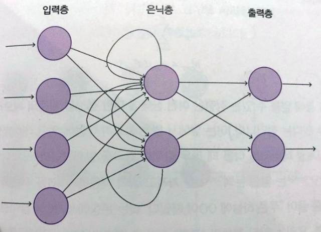
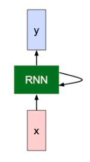
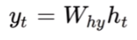
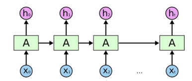
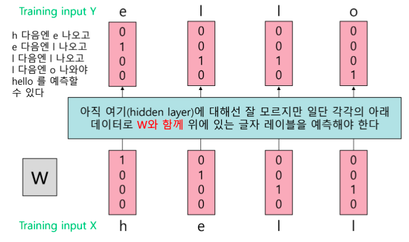
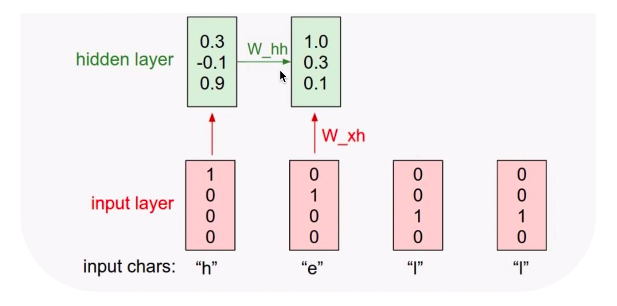
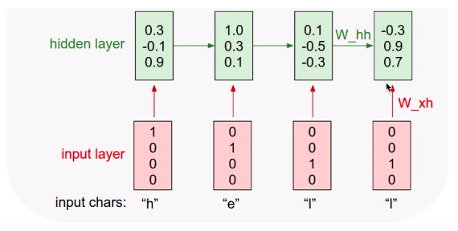
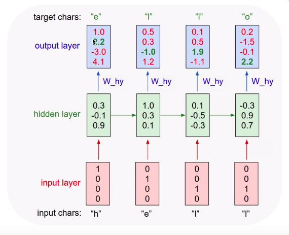

# Vanilla RNN

## Vanilla RNN

가장 단순한 형태의 RNN 모델

### 구조



* 이전 시간 ( t-1 ) 의 은닉층의 출력값을 다음 시간 ( t ) 에 은닉층의 입력값으로 다시 집어넣는 경로가 추가됨

* 장점 : **이전** 상태에 대한 정보를 **일종의 메모리 형태로 저장**할 수 있음

  > 엄밀히 말하면 이전. 이후 상태까지 고려하려면 Bidirectional RNN 사용

<br>

### Sequence data & State


* t 자리에 1이 증가할 때 마다 input이 들어오고 있는 시계열 데이터
  * 시계열 데이터 : 시간축을 중심으로 현재 시간의 데이터가 앞, 뒤 시간의 데이터와 연관 관계를 갖고 있는 데이터
* 처음의 계산이 그 다음 계산에 영향을 미침
* state 개념 존재
  - 예전 상태와 x값을 입력으로 받고, 특정 함수를 거쳐서 new state 가 탄생
* 셀에서 만들어지는 상태 데이터는 보통 hidden state 라고 함 ( h<sub>t</sub>로 표기 )

<br>

### y = Wx + b

 

- 여기서 y 와 위의 h<sub>t</sub> 는 다름! y는 **예측 값**, h<sub>t</sub> 는 **상태**

- 이 그림에서는 예측 값인 y를 표현하는 대신 상태를 의미하는 h는 표시하지 않은 것

  > 밑에 y와 h가 함께 표시된 그림 있음 [<sup>1</sup>](#1)

- 전달될 때, **y가 전달되는 것이 아니라 h<sub>t-1</sub>가 h<sub>t</sub>로 전달되는 것**임에 주의 !

<br><br><br><br><br>

### 공식으로 표현하기


* [x] **old state 와 x를 input으로 사용하여 new state를 구함.**

* 코드로 나타내면

```python
  for _ in range(노드 갯수):
      현재 상태 = W에 대한 함수(이전 상태, 입력 벡터)
```

> 여기서 노드 갯수 = layer 에 포함된 노드 (그림에서는 초록색 박스로 표시된 RNN) 갯수를 말함

* **t** : sequence data에 대한 특정 시점의 데이터

<br>

* [x] **W의 이전 상태와 입력을 갖고 f<sub>w</sub> 에 해당하는 *tanh* 함수를 호출**


* **h<sub>t</sub>** : 현재 상태 의미, 이전(old) 상태와 입력 값(x)을 사용해서 계산함

* [x] **예측 값 계산**



* **y<sub>t</sub>** : 예측 값 의미, W와 현재 상태 (h<sub>t</sub>)를 곱해서 계산함

<br>

#### Weight

위 식들에서 **모든 RNN Layer에 적용되는 Weight** **W<sub>hh</sub>, W<sub>xh</sub>, W<sub>hy</sub> 는 똑같다**는게 포인트!


## 작동 방식

예 ) 예제에서 h,e,l,o를 넣었을 때 hello라고 예측하는 시스템



* ### 원하는 것

  * **x<sub>0</sub> = h** --> **h<sub>0</sub> = e**
  * **x<sub>1</sub> = e** --> **h<sub>1</sub> = l**
  * **x<sub>2</sub> = l** --> **h<sub>2</sub> = l**
  * **x<sub>3</sub> = l** --> **h<sub>3</sub> = o**

  * 이런 식으로 ,,, 네이버 검색창 자동완성 기능처럼 ! ==> language model


* ### 각각의 입력을 벡터(0,1)로 표현

  * hello는 h,e,l,o 4개의 알파벳으로 이루어져 있음

    * h = [1,0,0,0], e = [0,1,0,0], l = [0,0,1,0], o = [0,0,0,1] 

      보통은 이렇게 크기가 4인 one-hot encoding으로 표현할 수 있음 

    * Vanilla RNN 에서는 이를 **세로로 세운 모양**으로!



> 위에서 모든 레이어에 적용되는 W는 같다고 했었음!


* ### h<sub>0</sub> 구하기

  * 

    위에서 본 이 식을 통해 구하면 된다!

  * 이때는 h<sub>t-1</sub>, 즉 이전 상태가 없으므로 0으로 두고 시작

    *  위 식에서 W<sub>hh</sub>h<sub>t-1</sub> 은 없는 거나 마찬가지, 즉 x<sub>0</sub>에 W값만 곱한 것!
    * W는 학습에 의해 주어진 값임. 그에 따라 아래와 같이 계산되었다고 가정 


* ### h<sub>1</sub> ... 구하기



* 그 다음 h<sub>1</sub> 은, 위와 같이 x<sub>1</sub> 과 h<sub>0</sub> 두가지를 동시에 이용해서 연산을 하게 됨

* 

  마찬가지로 이 식을 그대로 사용한다! 이런식으로 쭉 쭉 하다보면

  

  마지막 셀까지 계산할 수 있다.


* ### y 구하기

  * 

    위 식과 같이 W만 곱해주면 됨!

  * <a class="anchor" id="1"></a>

  * softmax라고 보면 된다고 한다. 가장 큰 값을 찾고 그걸 1이라고 두고 나머지는 0으로 둠

  * bold 처리된 글씨가 가장 큰 값이어야 우리가 원하는 값인데, 아닌 것도 있음. (y<sub>1</sub>) error


