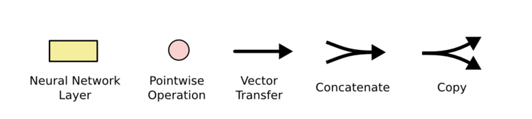
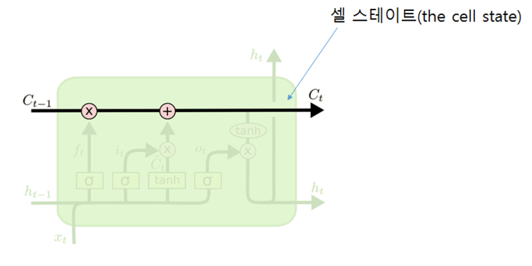
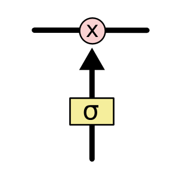
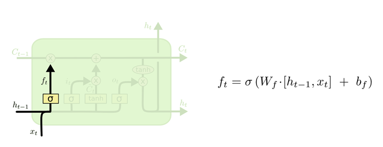
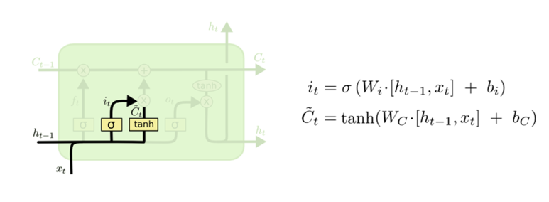
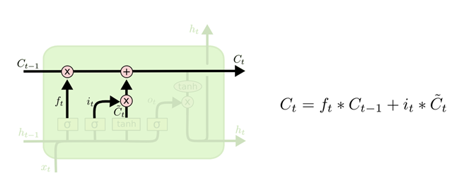
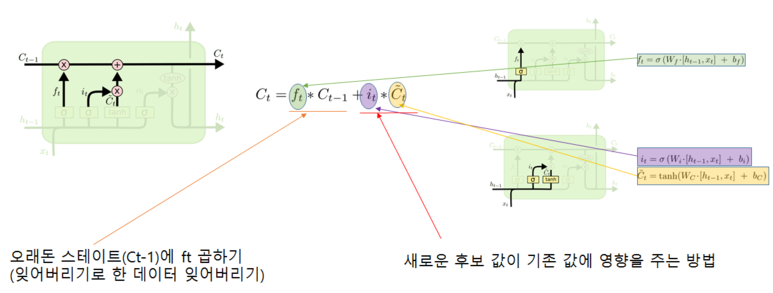
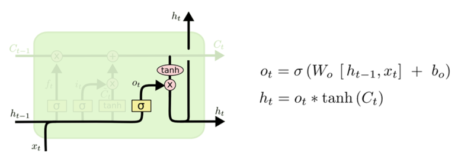

# LSTM

## RNN

아래 구조와 같다

이걸 펼치면

이런 모양! (시간축을 중심으로 펼쳐진 그림)

* RNN이 하나의 네트워크가 여러 개 복사된 형태로 구성되어 있고 각 네트워크는 다음 단계로 정보를 넘겨주고 있는 형태

# 장기 의존성 (Long-Term Dependency)의 문제점

### gap이 작을 때

> 제공된 데이터와 참고해야 할 정보의 위치가 비교적 가까움

* ex
  * "the clouds are in the sky" 라는 문장이 있을 때
  * "the clouds are in the" 라는 문장이 있다면 뒤의 단어가 "sky"일 확률이 높음.
    * 더이상의 문맥이 필요 없음
  * 제공된 데이터와 참고해야 할 정보의 입력 위치 차이(gap)가 크지 않음

### gap이 클 때

* ex
  * "I grew up in France... I speak fluent French" 라는 문장이 있을 때
  * "French"를 예측하고 싶음 --> 필요한 정보 = "France"
  * I grew up in France <--> I speak fluent French

* 제공된 데이터와 참고해야 할 정보의 입력 위치 차이(gap)이 큰 상황이 자주 발생
* 문장 표현의 순서 상 gap이 커질 수록 RNN은 두 정보의 문맥을 연결하기 힘들어지고 실제로 성능도 저하됨
* 좋은 해결책이 LSTM, 실제로 RNN의 성과들은 대부분 LSTM을 통해서 이루어짐!

## LSTM이란?

> 일반적인 RNN의 구조

이는 아래와 같이도 나타낼 수 있음

* 싱글 레이어(단일 tanh 레이어)를 가지고 반복되는 표준 RNN 모듈을 표현하고 있음
* 연속이 되어 있다는 의미에서 체인 구조라고도 부름

### LSTM 네트워크의 구조

* 표준 RNN은 싱글 레이어였지만, LSTM 네트워크는 훨씬 복잡한 구조를 가지고 있음
* 상호작용을 하는 4개의 레이어가 반복되는 모듈
  * 이 상호작용 구조가 입력된 데이터, 참고할 데이터의 gap이 커질 때 문맥을 연결하기 힘들었던 문제에 도움을 줌

### 기호 살펴보기

1. 뉴럴 네트워크의 레이어 단위를 표현. 각각 입력층과 출력층이 있음
2. 점 단위의 연산을 표현. (ex : 벡터의 더하기 연산)
3. 각 라인은 온전한 vector를 포함하고 있음. 각 출력값은 다른 노드의 입력값으로 들어감
4. 데이터들에 변화가 일어나는 것은 아님. 한 곳에 합쳐져서 같이 이동하는 것을 의미
5. 결과 값이 복사되는 것을 의미

### 셀 스테이트 (the cell state)

LSTM의 핵심적인 부분

* 하나의 **컨베이어 벨트**처럼 전체 체인을 통과함
* 이 구조를 통해서 정보는 큰 변함 없이 계속 다음 단계에 전달이 될 수 있음

* **gate** 요소
  * LSTM 은 이 셀 스테이트에 신중하게 정제된 구조를 가진 gate라는 요소를 활용해서 정보를 더하거나 제거하는 기능을 수행
  * gate들은 선택적으로 정보들이 흘러들어갈 수 있도록 만드는 장치를 의미함
  * gate들은 시그모이드 신경망 레이어와 점단위 곱하기 연산으로 구성되어 있음

### 시그모이드 레이어

* 0 또는 1의 값을 출력
* 각 구성요소가 영향을 주게 될지를 결정해주는 역할
  * 0 : 아무런 영향 X
  * 1 : 해당 구성요소가 확실히 미래의 예측결과에 영향을 주도록 데이터가 흘러가게 함

### 3가지 게이트들

* 셀 스테이트를 보호하고 컨트롤하기 위해서 세 가지 게이트들을 이용
  * forget gate layer (시그모이드 레이어)
  * input gate layer (시그모이드 레이어)
  * tanh layer

### LSTM STEP 1

* 셀 스테이트에서 어떤 정보를 버릴지 선택하는 과정
* forget gate layer (시그모이드 레이어)

* 0과 1사이의 출력값을 가지는 ht-1과 xt 를 입력 값으로 받음
  * xt : 새로운 입력값
  *  ht-1 : 이전 은닉층에서 입력되는 값
* 출력값이 1인 경우 완전히 이 값을 유지하게 되고 출력값이 0이 될 경우 완전히 이 값을 버리는 것

### LSTM STEP 2

* 새로운 정보가 셀 스테이트에 저장될지를 결정하는 단계

* input gate layer (시그모이드 레이어)
  * 어떤 값을 우리가 업데이트 할 지를 결정하는 역할
* tanh layer
  * 셀 스테이트에 더해질 수 있는 새로운 후보 값 Ct 를 만들어 냄

### LSTM STEP 3

오래된 셀 스테이트(Ct-1)를 새로운 스테이트인 Ct로 업데이트

앞의 단계에서 얻은 값들을 토대로 셀 스테이트를 업데이트

### LSTM STEP 4

어떤 출력값을 출력할지 결정

1. 어떤 값을 출력할지 결정하는 시그모이드 레이어
2. 셀 스테이트의 값이 tanh 함수를 거쳐서 -1과 1 사이의 값으로 출력
3. 1의 시그모이드 레이어에서 얻은 값과 2의 tanh 함수를 거쳐 얻은 값을 곱해서 출력

여기까지가 **표준적인 LSTM 방식**.

이외에도 여러 변칙 패턴들이 등장했고 성능도 좋다고 함.

## 다음에는

LSTM 변칙패턴들 + 실습 하나 해보기

