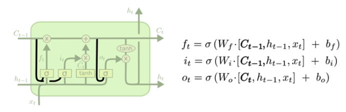
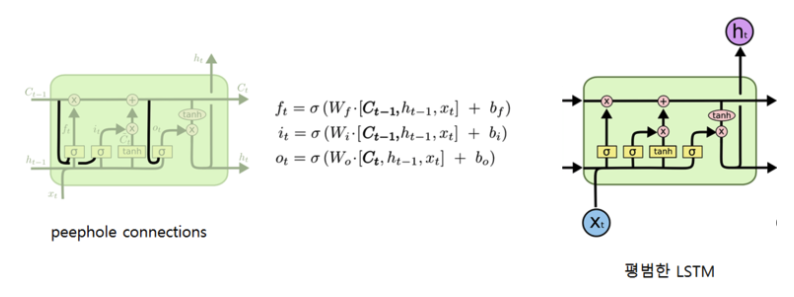
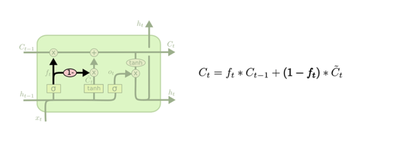
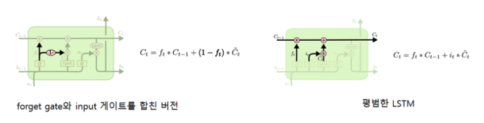
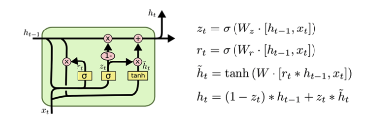
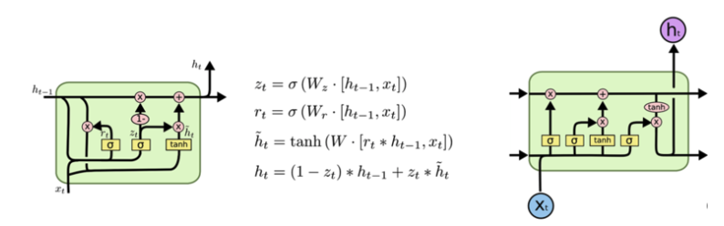

# LSTM의 변칙패턴들

* LSTM을 다루는 거의 모든 논문이 제각각 조금씩 다른 버전을 채용

### 변칙패턴1 - peephole connection 추가

* [Gers & Schmidhuber (2000)](ftp://ftp.idsia.ch/pub/juergen/TimeCount-IJCNN2000.pdf) 이 소개
* 게이트가 셀 스테이트 자체를 입력값으로 받음
* peephole connection(엿보기 구멍)을 추가한 모델
* 위 그림은 모든 gate 마다 엿보기 구멍을 달아놓은 것이고, 어디에는 달고 어디에는 안 달고 할 수 있음.
* 비교

### 변칙패턴2

* forget gate 와 input gate를 합친 버전
* 어떤 값을 잊어버리고 어떤 값을 더할지 정하는 과정을 따로 수행하지 않고 이를 동시에 결정하는 방식
* 새로운 값이 제공될 때만 이전 값을 잊어버림
* 기존 lstm 보다 단순한 구조를 가짐

* 비교
* 

### 변칙패턴3 - GRU

* the Gated Recurrent Unit (GRU)
* forget gate와 input gate를 하나의 업데이트 게이트로 통일
* 셀 스테이트와 히든 스테이트를 하나로 합침
* 비교

### -

