# Bidirectional RNN

## BRNNs

* RNNs (Recurrent Neural Networks) 를 확장시킨 형태
  * 과거의 상태뿐만 아니라, 미래의 상태까지 고려함
  * BRNNs (Bidirectional Recurrent Neural Networks)
* 일반 Neural Networks 에 비교해서 데이터의 이전 상태 정보를 **메모리** 형태로 저장할 수 있다는 장점
* 더 좋은 성능!
  * 시계열 데이터에서 현재 시간 이전 정보뿐만 아니라, 이후 정보까지 저장해서 활용하기 때문
  * ex) "푸른 하늘에 XX이 떠있다" 에서 XX를 예측해야 할 때
    * '푸른', '하늘' 을 가지고도 XX를 '구름' 이라고 예측하는 것과
    * '푸른', '하늘', '떠있다' 를 가지고 XX 를 '구름' 이라고 예측하는 것은 확률이 다름
    * BRNNs 를 이용하면 이렇게 이전 정보와 이후 정보를 모두 저장할 수 있음

## BRNNs 의 architecture

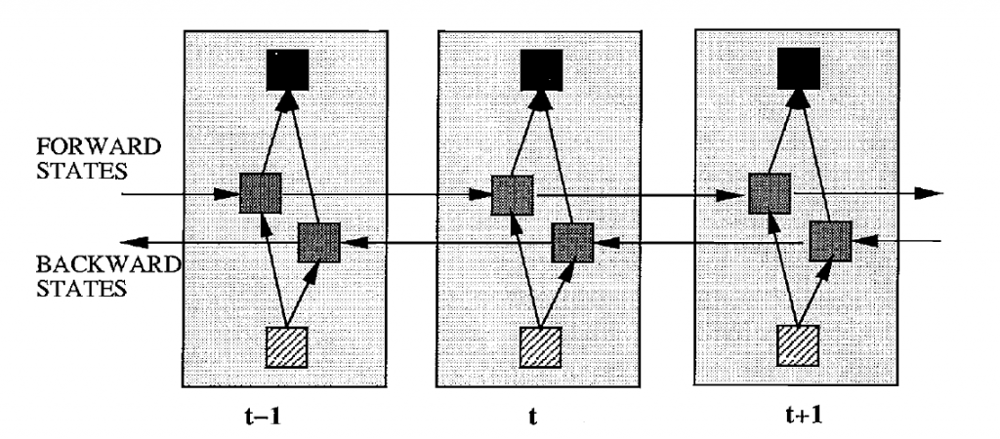

* **펼쳐진(unfolded) 형태**
* 2개의 Hidden layer
  * 전방향 상태(Forward states) 정보를 가지고 있는 Hidden layer
  * 후방향 상태(Backward stated) 정보를 가지고 있는 Hidden layer
  * 둘은 서로 연결되어있지 않음
  * 입력값은 2가지 Hidden layer에 모두 전달됨
  * Output layer 도 이 2가지 Hidden layer 로 모두 값을 받아서 최종 Output을 계산함

### 수식으로 나타내기

시간 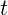에서 전방향 hidden layer 의 활성값(activation) output 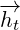, 

후방향 hidden layer의 활성값(activation) output 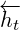, 

output layer의 output 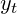은 다음과 같이 계산함.

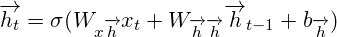

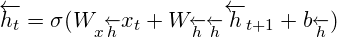

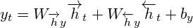

여기서 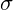 는 Sigmoid 나 ReLU 같은 활성 함수 (activation function)

## Forwardpass 계산 진행

* 기본적으로 RNN 과 동일.

* Forward hidden layer와 Backward hidden layer에 input 값을 반대 방향(opposite)로 집어넣고,

  Output layer 값은 두 방향의 Hidden layer에 모든 input이 적용된 후에 계산한다는 것이 차이점

* 알고리즘 형태로 나타내기

  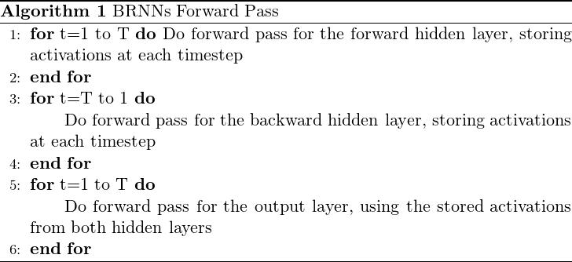

## Backwardpass  계산 진행

* Backwardpass의 가중치 업데이트때에는 기본적인 RNN 과 같이 **BPTT** 를 사용함.

  * BPTT(Backpropagation through time)
  * 특정 rnn을 트레이닝 시키기 위해 사용되는 gradient-based 기술

* Output layer에서 모든 시간에 대해 에러값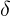 를 먼저 계산하고

  이를 Forward hidden layer와 Backward hidden layer에 **반대 방향으로 전달**한다는 점이 차이점

* 알고리즘 형태로 나타내기

  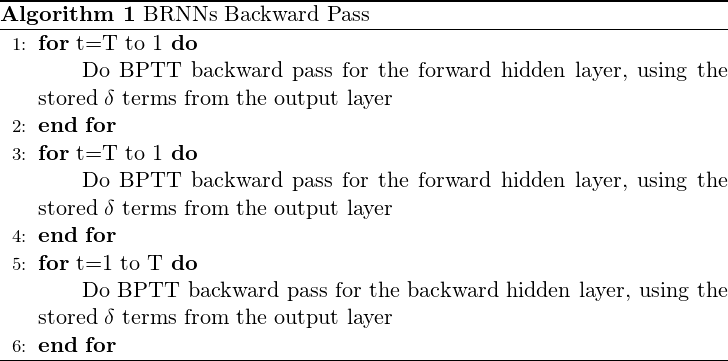

> LSTM은 개선된 BRNNs 의 형태

#### 다음시간엔

BPTT