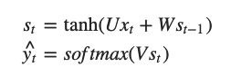
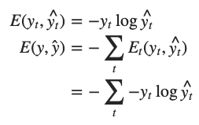
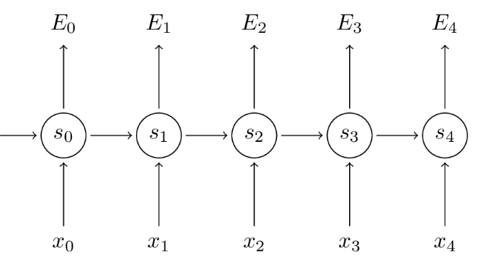
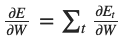
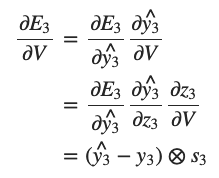
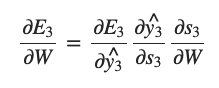
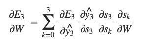
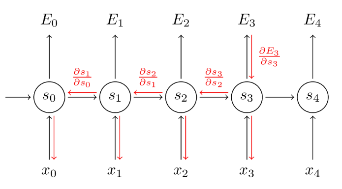

# BPTT

* Back Propagation Through Time

* RNN은 시간에 따라 펼쳐놓으면 구조가 MLP와 유사함
  * Back-propagation 방법으로 gradient 계산 가능
  * 그러나, 실제로 은닉층이 있는 것이 아니라 시간 차원에서 존재함
  * BPTT (Back Propagation Through Time) 사용

* 이번 시간 이해를 위해 도움이 되는 자료들 (편미분, BP)
  * [CS231n Convolutional Neural Networks for Visual Recognition](http://cs231n.github.io/optimization-2/)
  * [Calculus on Computational Graphs: Backpropagation](http://colah.github.io/posts/2015-08-Backprop/)
  * [How the backpropagation algorithm works](http://neuralnetworksanddeeplearning.com/chap2.html)

## BPTT 이해하기

### RNN의 기본 수식

> RNN의 기본 계산 수식

st = vanilla rnn 문서에서의 ht에 해당 (new state)

^yt = 예측값

### cross entropy로 정의한 Loss(에러)

yt = 시간 스텝 t에서 실제 단어

^yt = 우리의 예측값

* 보통 전체 시퀀스(문장)를 하나의 학습 데이터(샘플)로 생각
* 총 에러는 매 시간 스텝(단어) 마다의 에러의 총 합으로 취함

### 과정

* 목표
  * 파라미터 U, V, W에 대한 에러의 gradient를 계산해서 
  * Stochastic Gradient Descent (SGD)를 이용해 좋은 파라미터 값을 찾기

* 에러들을 더하듯, 매 시간 스텝의 gradient도 하나의 학습 데이터에 대해 모두 더해준다.
  * 
* 이 gradient들을 계산하기 위해서는 미분의 chain rule을 사용함
* 에러에서부터 거꾸로 된 방향으로 계산하는 것이 결국 BP!

### 예시 : E3

* 위 식에서, z3 = Vs3 이고, ⊗는 두 벡터의 외적임
*  **∂E3/∂V 가 현재 시간 스텝의 ^y3, y3, s3 에만 의존**
  * 이 세 값을 갖고 있다면 V 에 대한 gradient를 계산하는 것은 단순한 행렬곱이 된다.

* 그러나, ∂E3/∂W, ∂E3/∂U 에 대해서는 상황이 조금 다름
* chain rule을 위와 같이 전개해 보면,
  * 
  * st=tanh(Uxt+Wst−1)는 s2에 의존하고, 
  * s2는 W와 s1에 의존해서 chain rule이 계속 이어짐 (예시가 E3 이고,  여기서 t=3 이므로) 
  * 따라서, W에 대한 미분을 하기 위해서는 s2를 단순히 상수로 취급하면 안 됨.

* 각 시간 스텝이 gradient에 기여하는 것을 모두 더해줌

* 즉, W는 우리가 현재 처리중인 출력 부분까지의 모든 시간 스텝에서 사용되기 때문에,

  t=3 부터  t=0 까지 gradient들을 전부 backpropagate(역전파, 거꾸로 계산해주는 과정) 해줘야 함

* BP와의 차이점 : 매 시간 스텝마다 W에 대한 gradient를 더해준다는 점
  * 기존의 신경망 구조에서는 layer 별로 파라미터를 공유하지 않기 때문에 계산 결과들을 서로 더해줄 필요 X

* 입력 시퀀스(문장)들은 20단어가 넘을 정도로 길 수 있음
  * 매우 깊은 layer들에 BP 해 주어야 함
  * 실제 상황에서는 보통 BPTT를 할 시간 스텝을 적당한 숫자로 정해줌

## 다음시간에는

BPTT 심화