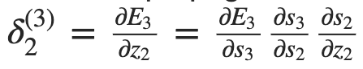
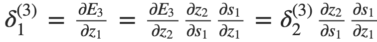
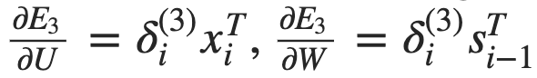

# BPTT 심화

* BPTT 과정 = deep Feedforward Neural Network 에서 사용하는 원래의 backpropagation 알고리즘과 동일
  * deep Feedforward Neural Network : 깊은 피드포워드 신경망 구조, 피드백 연결이 없는 네트워크
* 중요한 차이점
  * 매 시간 스텝마다 W에 대한 gradient를 더해 줌
  * 기존의 신경망 구조 —> layer별로 파라미터 공유 X —> 계산 결과들을 서로 더해 줄 필요 X


### vector

* backpropagation 처럼 이전 layer로 전해주는 델타 벡터를 정의

  

  * 여기서 z<sub>2</sub> = U<sub>x<sub>2</sub></sub> + W<sub>s<sub>1</sub></sub> 이다.
    * 2번째 시간 스텝의 activation 에서 nonlinearity를 거치기 이전 상태
    * 이전 시간 스텝에도 같은 수식 적용

* 이전 스텝의 델타 벡터

  

* 델타 벡터 값을 알고 있으면 파라미터에 대한 gradient를 계산하는게 편리함

  * 시간 스텝 i일 때 

    

    처럼 벡터 외적 한 번으로 얻을 수 있음

  * RNN이므로 계산된 값들은 더해줘야 함


### code

```python
def bptt(self, x, y):
    T = len(y)
    # Perform forward propagation
    o, s = self.forward_propagation(x)
    # We accumulate the gradients in these variables
    dLdU = np.zeros(self.U.shape)
    dLdV = np.zeros(self.V.shape)
    dLdW = np.zeros(self.W.shape)
    delta_o = o
    delta_o[np.arange(len(y)), y] -= 1.
    # For each output backwards...
    for t in np.arange(T)[::-1]:
        dLdV += np.outer(delta_o[t], s[t].T)
        # Initial delta calculation: dL/dz
        delta_t = self.V.T.dot(delta_o[t]) * (1 - (s[t] ** 2))
        # Backpropagation through time (for at most self.bptt_truncate steps)
        for bptt_step in np.arange(max(0, t-self.bptt_truncate), t+1)[::-1]:
            # print "Backpropagation step t=%d bptt step=%d " % (t, bptt_step)
            # Add to gradients at each previous step
            dLdW += np.outer(delta_t, s[bptt_step-1])
            dLdU[:,x[bptt_step]] += delta_t
            # Update delta for next step dL/dz at t-1
            delta_t = self.W.T.dot(delta_t) * (1 - s[bptt_step-1] ** 2)
    return [dLdU, dLdV, dLdW]
```

* 코드를 보면 RNN의 기본 형태 학습이 어려운것을 확인 할 수 있음
  * 입력 시퀀스(문장)들은 20단어가 넘게 길 수 있기 때문에 매우 깊은 layer들에 대해 backpropagate 해 줘야 함
  * 실제 상황에서는 보통 backpropagation through time 할 시간 스텝을 적당한 숫자로 정해줌